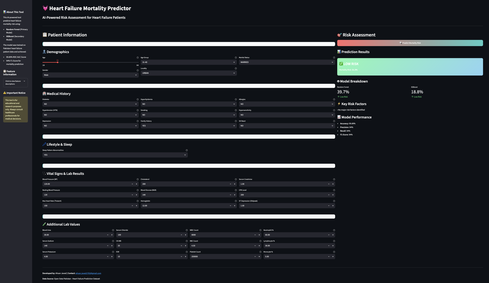

# ❤️ Pakistan Heart Failure Mortality Prediction



---

## 📑 Project Overview

This repository provides an end-to-end **Heart Failure Mortality Prediction** pipeline built specifically for **Pakistan’s population data**.  
It demonstrates how data science and machine learning can help predict the risk of heart failure mortality, and how to deploy it for real-world use.

---

## 📂 Contents

- 📒 **Jupyter Notebook**  
  - Detailed **EDA**, preprocessing, feature engineering, and model training.
  - Visualizations and performance evaluation.

- ⚙️ **Streamlit App** (`app.py`)  
  - A simple, interactive web app to test predictions using the trained model.
  - Easy to run locally or deploy online.

- 🐍 **Upcoming Python Project**  
  - The next version will include a **FastAPI** implementation for robust API deployment.
  - Supports integration with modern frontend or mobile apps.

- 🐳 **Planned Docker Deployment**  
  - A Dockerized version for easy deployment to cloud servers or containers.

---

## 📊 Dataset

- The dataset comes from **real patient data in Pakistan** (anonymized).
- It contains demographic details, lifestyle indicators, medical history, and key biochemical test results.
- Special focus is on locally relevant cardiovascular risk factors.

**Disclaimer:** The dataset is limited in scope and scale. It is meant for research and educational demonstration only — not for real clinical diagnosis.

---

## 🧮 Data Analysis & Model

- **Exploratory Data Analysis (EDA)**  
  - Detect outliers, missing values, and correlations.
  - Visualize distributions and relationships.

- **Preprocessing & Feature Engineering**  
  - Categorical encoding, scaling, and handling missing data.
  - Feature selection for best model performance.

- **Machine Learning Model**  
  - **Random Forest Classifier** — chosen for its balance of performance and interpretability.
  - Evaluated using metrics like Accuracy, ROC-AUC, Confusion Matrix, and Feature Importance.

---

## 🚀 Deployment

✅ **Current Status:**  
- **Streamlit App**: Users can input patient data through a simple UI and get instant predictions.

📌 **Planned:**  
- **FastAPI Backend**: Serve the model as a production-grade REST API.
- **Docker**: Build and deploy the API and app in containers for easy scaling.

---

## 📷 User Interface


*Above: Example of the prediction UI (replace with your actual screenshot).*

---

## ⚙️ How to Run

1. Clone this repo:
   ```bash
   git clone https://github.com/ahsan-javed-ds/pakistan-heart-failure-mortality-prediction.git
   cd pakistan-heart-failure-mortality-prediction
   ```
   ```bash
   pip install -r requirements.txt
   ```
   ```bash
   streamlit run app.py
   ```

### OR

2. Simply run the attached Colab Notebook: [Pakistan Heart Failure Mortality Prediction Notebook](./pakistan_heart_failure_mortality_prediction_ahsan_javed.ipynb)


## ✅ **Contribution & Impact**
This project highlights how AI solutions can support healthcare in Pakistan by:

- Providing early risk prediction tools for hospitals and clinics.

- Encouraging data-driven awareness of key mortality factors.

- Demonstrating how local data can be used to build local solutions.

## ⚠️ **Limitations**
- The dataset is small and may not cover all demographic and medical variations.

- Predictions are not medically certified — they are for educational and research purposes only.

- For real-world use, larger, validated datasets and clinical testing would be required.

## 🤝 **Contributions**
All contributions are welcome!

📌 Ideas for improving the notebook, app UI, expanding the dataset, or adding new deployment methods (FastAPI, Docker) are highly appreciated.

Please open an issue or submit a pull request to collaborate.

## 📜 **License & Disclaimer**
This project is open for educational and non-commercial research use only.
Always consult qualified healthcare professionals for any real medical decisions.

## 📧 Contact
**Author:** Ahsan Javed
* **Email:** ahsan.javed1702@gmail.com
* **GitHub:** [https://github.com/ahsan-javed-ds](https://github.com/ahsan-javed-ds)
* **LinkedIn:** [https://www.linkedin.com/in/ahsan-javed17/](https://www.linkedin.com/in/ahsan-javed17/)
